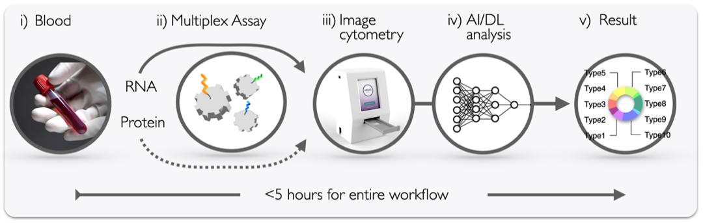

**High-throughput, Multiplexed Assay Platform for Integrated Analysis of Sepsis**
___
FILL
___

# Table of Contents
* [Datasets/Results](docs/data.md) - Datasets used in the study as well as the final training results.
* [Notebooks](docs/notebooks.md) - Notebooks used in the study to train the models as well as perform the Bayesian hyperparameter search for the models.
___

# Environment Installation

FILL
___

# Citation
If you found this work to be helpful, please cite our paper:

`FILL`
___

# Acknowledgements

    
    &nbsp; &nbsp;

*This material is based upon work supported by the National Science Foundation Graduate Research Fellowship under Grant No. DGE 1841052.

Any opinion, findings, and conclusions or recommendations expressed in this material are those of the authors(s) and do not necessarily reflect the views of the National Science Foundation.*

